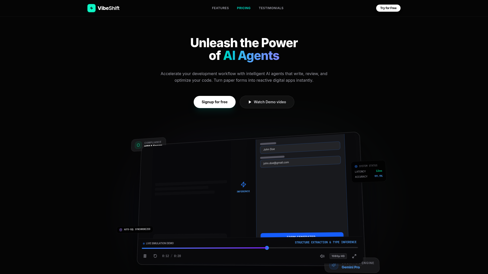

<div align="center">

# ⚡ VibeShift — AI Digitalizer

**Turn any paper document into a live web app — in seconds. No code needed.**

[](https://vibeshift-ai-digitalizer.vercel.app)
[](https://drive.google.com/file/d/1QY5M4Jd74g5-qCXYrwLdcC3yz9gWnXNj/view?usp=sharing)

<br/>

<a href="https://vibeshift-ai-digitalizer.vercel.app">
  
</a>

*The live VibeShift website — click the image to open it.*

</div>

---

## 💡 What is VibeShift?

VibeShift is an AI system that takes a **photo of any paper document** — a restaurant menu, an admission form, an invoice, a product catalog — and instantly turns it into a **working web application**.

You don't write any code. You don't design anything. You just upload a picture.

**How it decides what to build:**

| You upload... | VibeShift builds... |
|---|---|
| 🍽️ A restaurant menu | An online ordering portal with a shopping cart |
| 📋 A paper form | A digital form with validation + database |
| 🛍️ A product catalog | An e-commerce storefront |
| 🧾 An invoice / register | A structured data-entry app |

The AI reads the document, understands its *purpose*, and generates the right app automatically.

## 📸 Example: Menu → Ordering App

**Step 1 — Upload a photo of a menu:**

<div align="center">
  
</div>

**Step 2 — VibeShift detects "ordering" intent and builds this automatically:**

<div align="center">
  
</div>

A complete ordering portal — selectable items, live shopping cart, ready for customers. **Zero code written.**

## ✨ Features

- 🧠 **Autonomous Decision Engine** — Gemini AI understands the document and picks the right app type by itself
- 📊 **Analytics Dashboard** — live charts for your generated apps
- 🤖 **Built-in Chatbot** — AI assistant inside the app
- 🔄 **Workflow Agent** — automates multi-step processes
- 🎨 **Modern 3D UI** — animated landing page with interactive cards
- 🔐 **Firebase-ready** — optional auth and real-time database

## 🛠️ Built With

`React 19` · `TypeScript` · `Vite 6` · `Tailwind CSS 4` · `Google Gemini AI` · `Firebase` · `Recharts` · `Vercel`

## 🚀 Run It Yourself

```bash
git clone https://github.com/vaibhav410/VibeShift-AI-Digitalizer.git
cd VibeShift-AI-Digitalizer
npm install
cp .env.example .env.local   # add your GEMINI_API_KEY inside
npm run dev
```

Open **http://localhost:3000** — done. 🎉

> Free Gemini API key: [Google AI Studio](https://aistudio.google.com/apikey)

## 🌍 Why I Built This

In many colleges and local communities, everyday processes still run on paper — admission forms, canteen menus, event registrations. VibeShift removes the technical barrier completely:

> **If you can take a photo, you can launch an app.**

---

<div align="center">

Built with ❤️ by **[Vaibhav Kumar Kanojia](https://github.com/vaibhav410)**

⭐ **Star this repo** if you like it!

</div>
